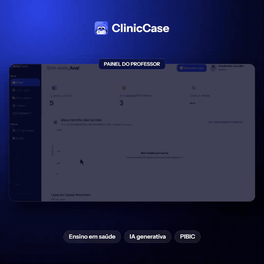

<div align="center">


# ClinicCase

**Plataforma educacional com IA generativa para criar, revisar e aplicar casos clínicos no ensino em saúde.**

[](#tecnologias)
[](#tecnologias)
[](#tecnologias)
[](#tecnologias)
[](#deploy)
[](LICENSE)

[Site](https://cliniccase.site) · [Portfólio](https://emanuelcandido.github.io/Portifolio/#cliniccase) · [Backend](backend/README.md) · [Frontend](frontend/README.md)

</div>

---

## Prévia

<div align="center">

<a href="docs/media/previa.mp4"></a>

<sub>Clique na imagem para ver a <a href="docs/media/previa.mp4">prévia em MP4</a> (melhor qualidade).</sub>

</div>

## Sobre o projeto

O **ClinicCase** nasceu de um projeto de iniciação científica (**PIBIC**) no Centro Universitário Santo Agostinho (UNIFSA) e foi apresentado em eventos acadêmicos. É um sistema web em que professores da área da saúde configuram o que querem ensinar e a plataforma gera, com IA generativa, um **caso clínico completo**: dados do paciente, anamnese, exame clínico, hipótese diagnóstica e perguntas avaliativas. Tudo continua editável, e o professor mantém o controle da versão final.

O projeto é composto por duas aplicações neste repositório:

| Pasta | Papel | Stack |
|---|---|---|
| [`frontend/`](frontend) | Portal do professor: criação de casos em etapas, painel de casos, exportação em PDF | React 19, Vite, JavaScript |
| [`backend/`](backend) | API REST: autenticação, regras de negócio, geração por IA, auditoria e limites de uso | Java 25, Spring Boot 4, Spring AI, PostgreSQL |

## Objetivo

Aproximar o aprendizado teórico da **tomada de decisão clínica**, oferecendo ao docente uma ferramenta que reduz o esforço de produzir material de qualidade e ao aluno a prática com situações realistas, sem expor dados de pacientes reais.

## Problemas que resolve

Segundo o levantamento feito com docentes durante a pesquisa, os principais obstáculos para usar casos clínicos em sala são:

- **Falta de tempo:** escrever um caso bem fundamentado, com perguntas e gabarito, consome horas. No ClinicCase, um caso completo é gerado em cerca de **15 a 25 segundos** (85,7% dos docentes apontaram a falta de tempo como principal dificuldade).
- **Conteúdo genérico:** ferramentas de IA de uso geral produzem casos sem aderência à disciplina, ao nível e ao objetivo de aprendizagem. Aqui, **especialidade, diagnóstico esperado e objetivo de aprendizagem** são âncoras obrigatórias definidas pelo professor.
- **Confiabilidade clínica:** textos gerados por IA podem ser incoerentes. A API valida a coerência entre os campos antes e depois da geração e responde com erros por campo, sem salvar conteúdo parcial.
- **Privacidade:** os prompts não devem conter dados reais de pacientes. O sistema exige a confirmação de que os dados são sintéticos ou desidentificados e segue uma [política de dados clínicos](backend/docs/politica-dados-clinicos.md).
- **Correção de respostas abertas:** questões discursivas não têm gabarito automático. Elas ficam pendentes de **revisão humana** e só entram na nota depois da decisão do professor.

## Funcionalidades

**Para professores**

- Criação guiada em etapas: parâmetros do caso, perfil do paciente, conteúdo clínico, perguntas e referências/mídias.
- Geração e ajuste do caso com IA (“tornar mais simples”, “tornar mais complexo” ou pedido livre de ajuste), além de edição manual de cada seção.
- Geração de perguntas de **múltipla escolha**, **verdadeiro ou falso** e **discursivas** (com rubrica estruturada), em lote e com distribuição por tipo.
- Definição de dificuldade e tempo limite, publicação do caso e acompanhamento do desempenho dos alunos.
- Exportação em **PDF**: folha do aluno e gabarito do professor.
- Rascunhos persistidos, para continuar o caso depois.

**Para alunos**

- Acesso a casos publicados, resolução dentro do tempo definido, resultado das respostas e histórico de desempenho.

**Para a plataforma**

- Perfis de acesso (administrador, professor e aluno), contas de demonstração com validade e limite de cadastros por IP.

## Arquitetura

```text
┌──────────────┐   HTTPS    ┌───────────────────────────┐        ┌────────────────┐
│  Frontend    │ ─────────► │  API Spring Boot          │ ─────► │  PostgreSQL    │
│  React/Vite  │            │  JWT · validações · cotas │        │  (Flyway)      │
└──────────────┘            └─────────────┬─────────────┘        └────────────────┘
                                          │ Spring AI (API compatível com OpenAI)
                                          ▼
                            ┌───────────────────────────┐        ┌────────────────┐
                            │  Gateway de modelos       │ ─────► │  Provedores    │
                            │  (FreeLLMAPI, fallback)   │        │  de LLM        │
                            └───────────────────────────┘        └────────────────┘
```

Fluxo de geração de um caso: **pré-validação** de coerência → **geração** → **pós-validação** → persistência. Cada clique envia um `Idempotency-Key`, de modo que uma nova tentativa após falha de rede não gera (nem cobra) duas vezes.

## Destaques técnicos

- **IA com guarda-corpos:** pré e pós-validação de coerência clínica, cache de aprovações por hash (sem armazenar texto clínico) e ordem de fallback entre modelos.
- **Idempotência e recuperação:** ledger de solicitações no PostgreSQL, com estados e reaproveitamento seguro de chaves em falhas incertas.
- **Controle de custo e abuso:** cotas por usuário (por minuto e por dia), limite global de gerações simultâneas e limite de tamanho de corpo de requisição.
- **Segurança:** JWT, senhas com BCrypt, bloqueio por tentativas de login, CORS restrito, validação de configuração na subida em produção e identificação confiável de IP atrás de proxy.
- **Observabilidade:** `X-Correlation-Id`, auditoria de gerações e métricas de latência por fase.
- **Banco versionado:** 23 migrações Flyway, com teste de migração em PostgreSQL real.
- **Front resiliente:** timeouts por tipo de operação, cancelamento de requisições, `Retry-After`, rascunhos locais e consumo de IA com pool de promessas.
- **Qualidade:** testes de unidade e integração (JUnit/Spring Test no backend e `node --test` no frontend), Checkstyle, SpotBugs, JaCoCo e CI no GitHub Actions.

## Tecnologias

| Camada | Tecnologias |
|---|---|
| Backend | Java 25, Spring Boot 4.1, Spring Security, Spring Data JPA, Spring AI 2.0, Flyway, Maven |
| Banco de dados | PostgreSQL (H2 em testes) |
| Frontend | React 19, React Router 7, Vite 8, TypeScript (checagem de tipos), jsPDF |
| IA | Spring AI com API compatível com OpenAI, via gateway FreeLLMAPI |
| Infraestrutura | Docker e Docker Compose, Caddy (HTTPS automático), GitHub Actions |
| Documentação da API | OpenAPI, coleção Postman e arquivo `.http` em [`backend/docs`](backend/docs) |

## Como executar localmente

**Pré-requisitos:** JDK 25, Node.js `^20.19.0` ou `>=22.12.0` e Docker.

1. **Banco de dados**

   ```bash
   cd backend
   # crie um .env com DB_USER e DB_PASSWORD (veja backend/docs/ia-piloto.md)
   docker compose up -d postgres
   ```

2. **API** (perfil `dev`, somente para desenvolvimento local)

   ```bash
   cd Sistema_Crud_API_PIBIC
   DB_USER=... DB_PASSWORD=... SPRING_PROFILES_ACTIVE=dev ./mvnw spring-boot:run
   ```

   Para usar a geração por IA, suba o gateway (`docker compose --profile ia up -d`) e configure `IA_CHAVE_API`. O passo a passo está em [`backend/docs/ia-piloto.md`](backend/docs/ia-piloto.md).

3. **Frontend**

   ```bash
   cd frontend
   npm install
   npm run dev
   ```

   O Vite encaminha `/api` para `http://127.0.0.1:8080`.

**Testes**

```bash
cd backend/Sistema_Crud_API_PIBIC && ./mvnw test
cd frontend && npm run check
```

## Deploy

A configuração usada na demonstração está em [`backend/deploy`](backend/deploy): API, gateway de IA e Caddy em Docker Compose numa VM gratuita, banco gerenciado no Supabase e frontend estático. Nenhuma credencial é versionada; todos os valores sensíveis vêm de variáveis de ambiente, conforme [`backend/deploy/.env.example`](backend/deploy/.env.example).

## Documentação

- [README do backend](backend/README.md) · [README do frontend](frontend/README.md)
- [Integração com IA](backend/docs/ia-piloto.md)
- [Política de dados clínicos](backend/docs/politica-dados-clinicos.md)
- [Guia de deploy](backend/deploy/README.md)

## Pesquisa

Artigo *“Plataforma Inteligente para Geração de Casos Clínicos com Inteligência Artificial: Uma Proposta para o Ensino em Saúde”*, que apresenta o MVP do ClinicCase. Detalhes e PDF na seção de artigos do [portfólio](https://emanuelcandido.github.io/Portifolio/#artigos).

## Equipe

Projeto desenvolvido em equipe no PIBIC/UNIFSA, com orientação docente do professor Anderson Soares Costa. Mantido por [Emanuel Cândido](https://github.com/EmanuelCandido).

## Licença

Distribuído sob a licença MIT. Veja [`LICENSE`](LICENSE).
